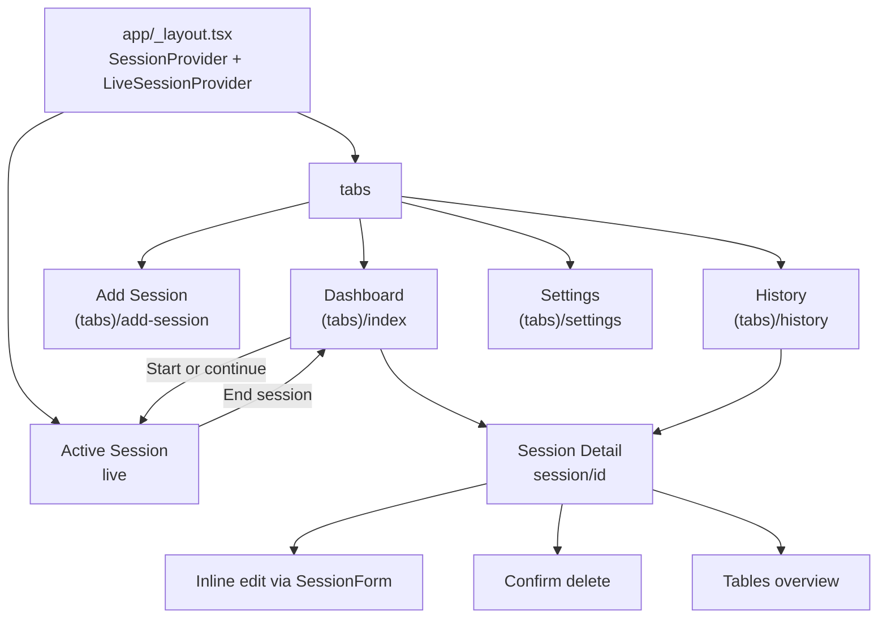
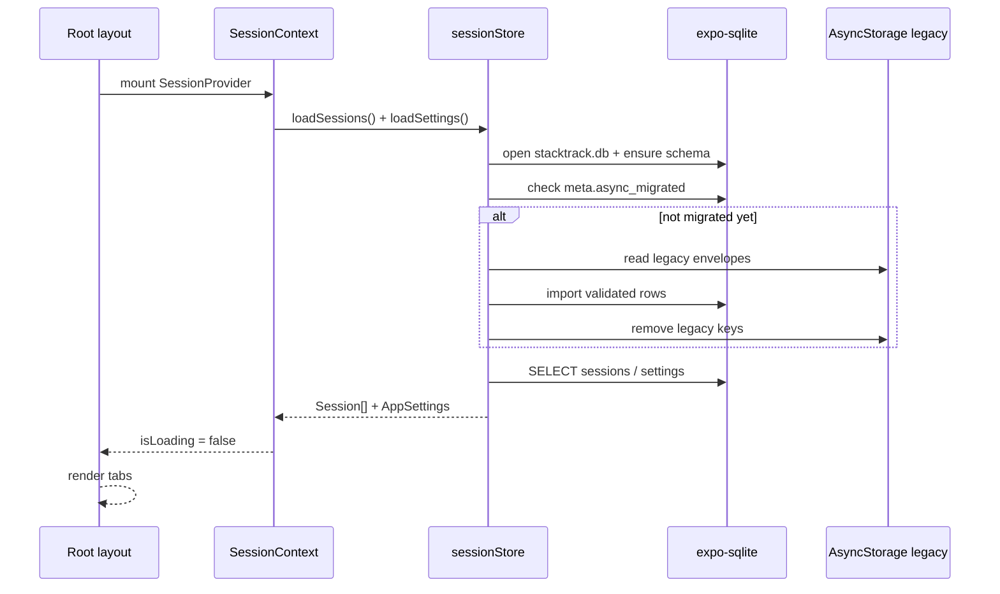
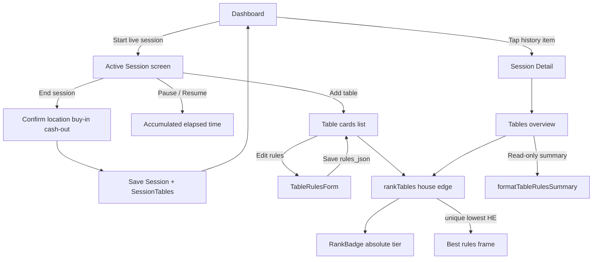
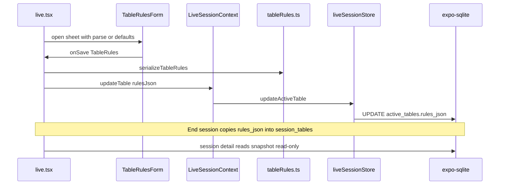
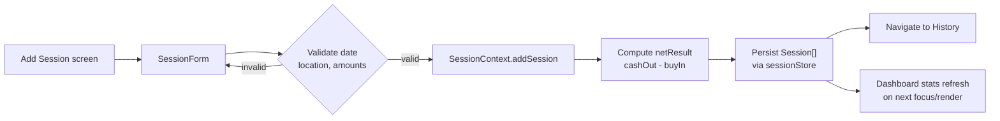
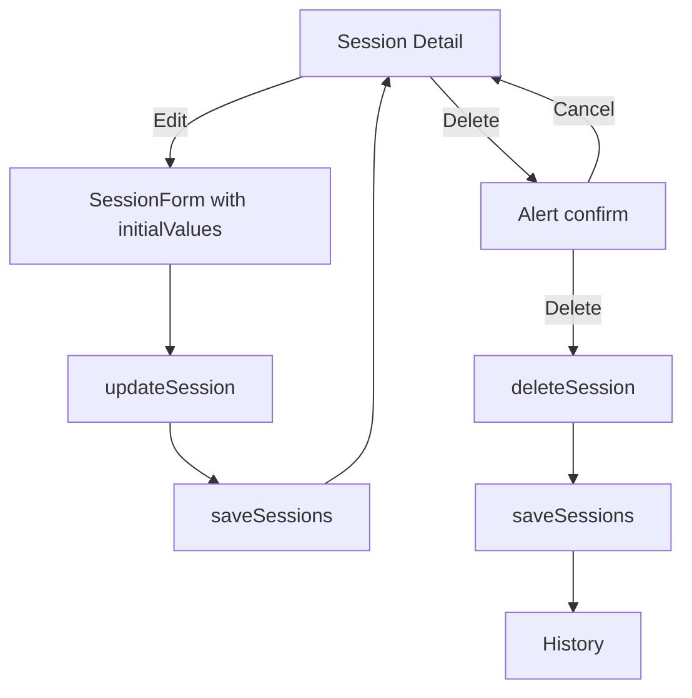
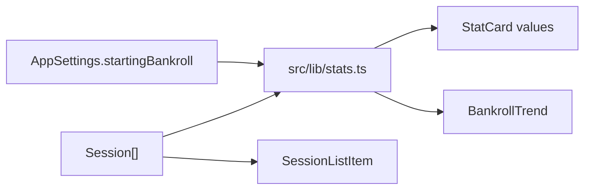
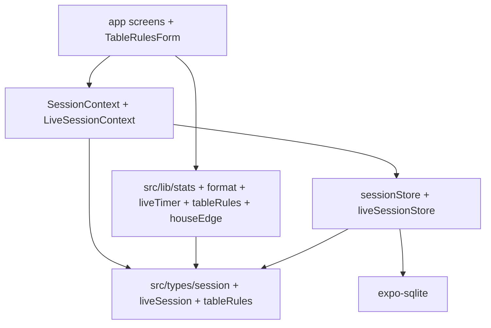

# StackTrack app flow

High-level navigation and data flow for the MVP.

## Navigation map

## Startup flow

## Live session flow

Timer state is persisted in `active_sessions`. On end, `hoursPlayed` comes from
elapsed ms; active rows are cleared after `session_tables` are copied.

## Table rules flow

## Add session flow

## Edit / delete flow

## Stats derivation flow

Dashboard does not store aggregates. It reads `sessions` + `settings` from
context and recalculates on each render.

## Layered architecture

Business logic stays in `src/lib` and `src/storage`. Screens stay thin and
mostly compose forms, lists, and derived values.
