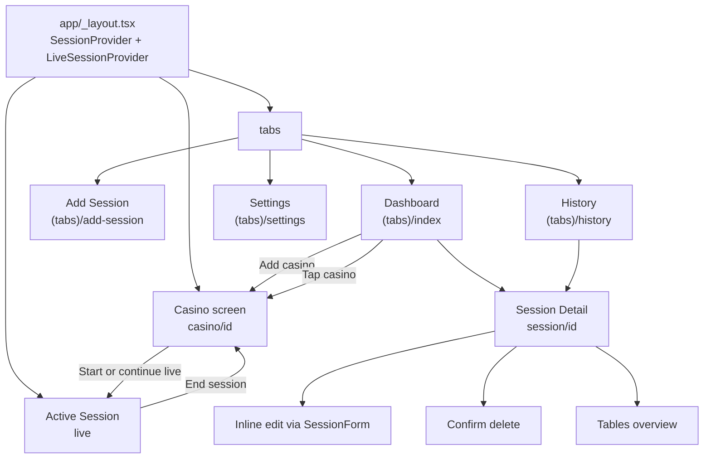
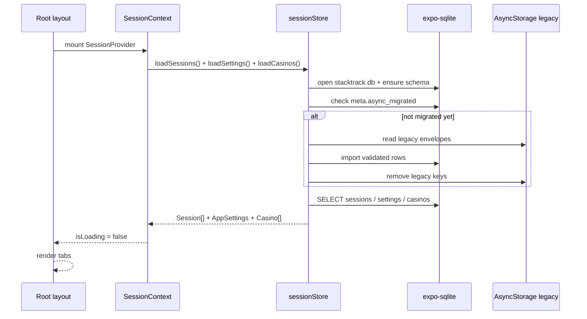
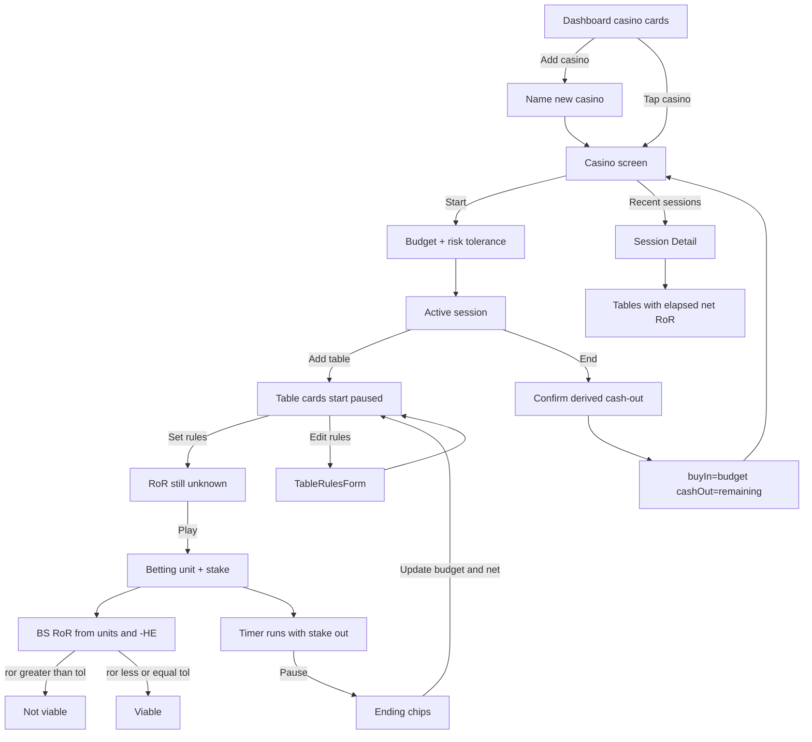
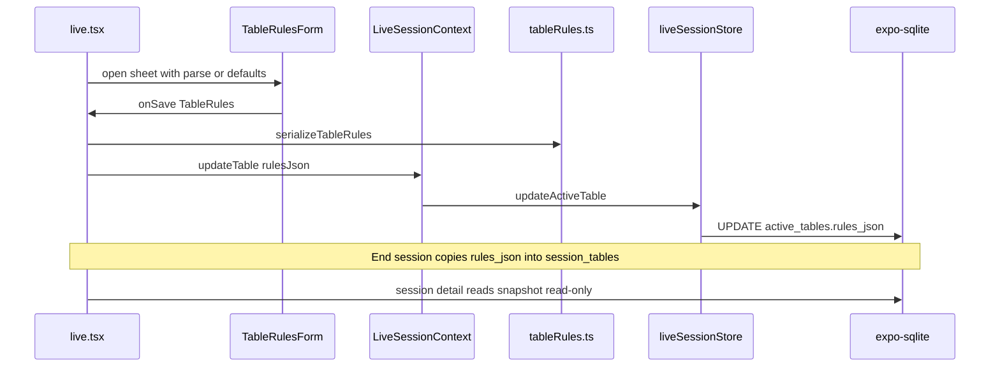
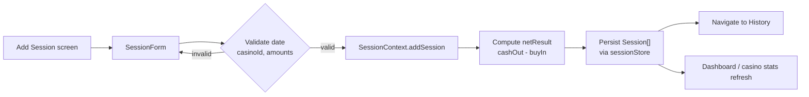
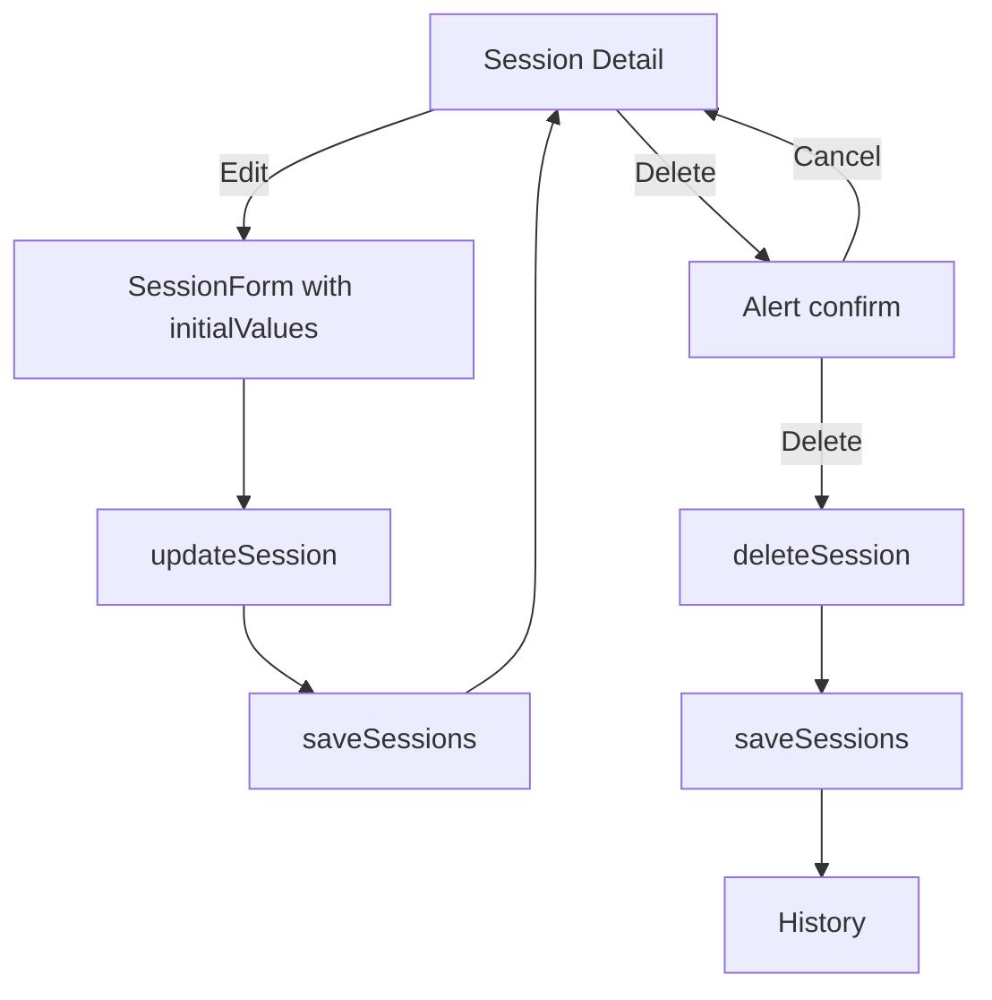
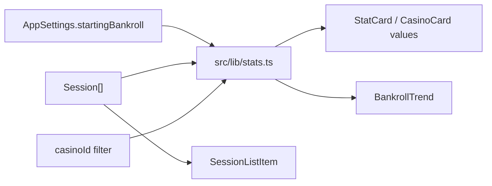
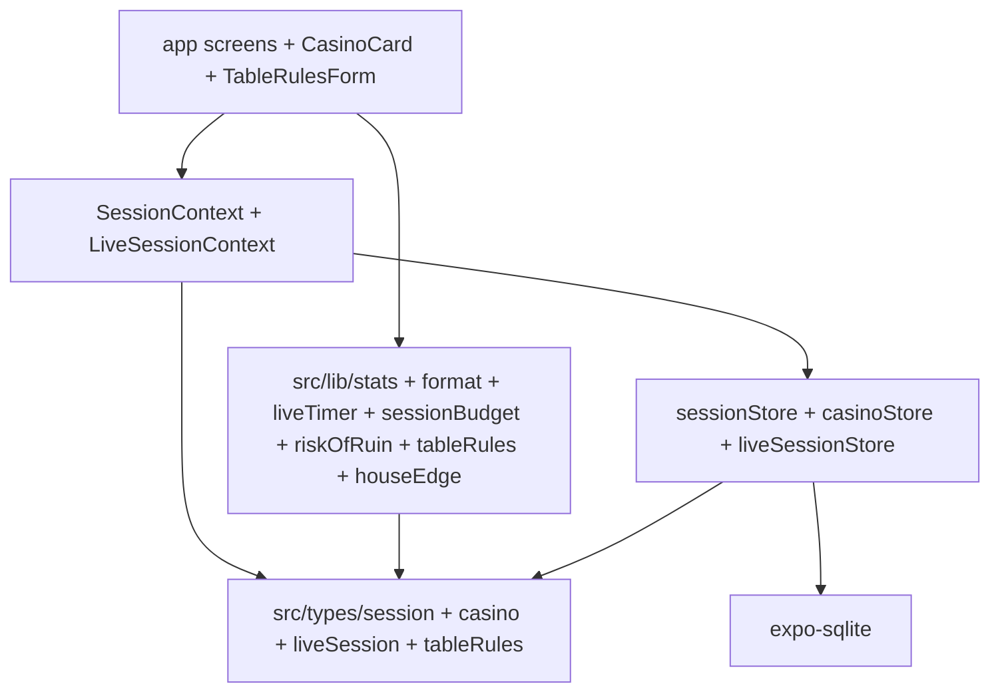

# StackTrack app flow

High-level navigation and data flow for the MVP.

## Navigation map

## Startup flow

## Live session flow

### Bankroll → budget → stake

- **Start session**: choose session budget (`0 < budget ≤ currentBankroll`) and **risk tolerance** preset
- **Play**: choose betting unit (`≥ table min`) and stake (`≤ remaining budget`); only one table may run
- **Pause**: enter ending chips; `net = ending − stake`; chips return to remaining
- **End**: confirmation only — persist `buyIn = budget`, `cashOut = remaining`,
  `netResult = cashOut − buyIn` (updates global bankroll via existing stats)
- Block end while any table still has stake out / is playing

Helpers: `assertBudget`, `assertStake`, `computeRemainingBudget` in
`src/lib/sessionBudget.ts`.

### Risk of Ruin (basic strategy)

- RoR is **unknown** until table rules and betting unit are set
- Estimate uses session bankroll (`remaining + open stakes`) ÷ unit and approximate house edge (BS only; no counting)
- If estimated RoR **>** session risk tolerance → **Not viable** visual (soft warn on Play)
- Helpers: `estimateBasicStrategyRoR`, `isTableViable` in `src/lib/riskOfRuin.ts`

### Per-table timers

Timers live on `active_tables` (`accumulated_ms`, `segment_started_at`,
`is_paused`, `paused_at`). Product rules:

- Starting a live session does **not** start time; Play starts the table timer
- New tables start **paused** at `0`
- Only **one** table may run; Play on another is blocked until pause + results
- Banner elapsed and end-session `hoursPlayed` are the **sum** of table elapsed times
- On end, snapshot each table’s elapsed to `session_tables.elapsed_ms`

Helpers: `sumTableElapsedMs`, `assertCanPlayTable`, `computeElapsedMs` in `src/lib/liveTimer.ts`.

## Table rules flow

## Add session flow

Manual add/edit uses a casino picker (select existing or create) so every
session stays a child of a casino.

## Edit / delete flow

## Stats derivation flow

Dashboard lists casinos with scoped aggregates. Casino screen filters sessions
by `casinoId` then reuses the same stats helpers. Hourly rate on the casino
screen uses that filtered list and `ceil(totalHours)` so brief sits do not
show extreme $/hr.

## Layered architecture

Business logic stays in `src/lib` and `src/storage`. Screens stay thin and
mostly compose forms, lists, and derived values.
