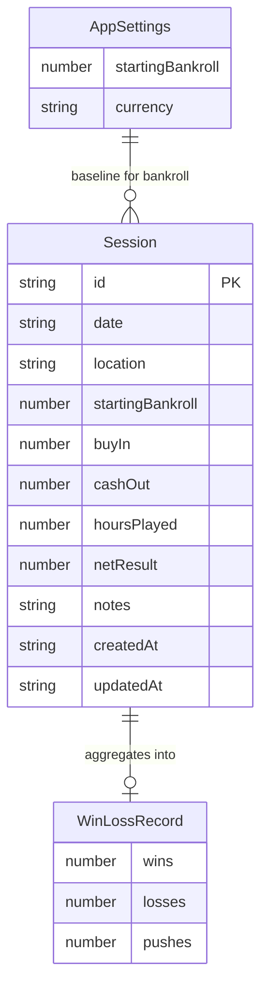
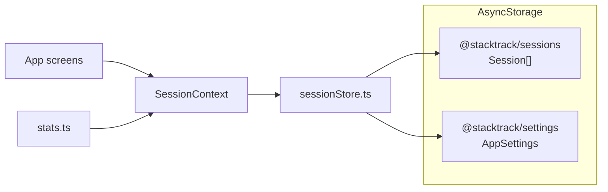

# StackTrack data schema

StackTrack is local-only for the MVP. Persistence uses AsyncStorage with two
keys and no remote backend.

| Key | Value |
| --- | --- |
| `@stacktrack/sessions` | `Session[]` JSON |
| `@stacktrack/settings` | `AppSettings` JSON |

On first launch, if no sessions exist, seed data from `src/data/sampleSessions.ts`
is written to storage.

## Entities

### Session

Primary record for one blackjack sitting.

| Field | Type | Required | Notes |
| --- | --- | --- | --- |
| `id` | `string` | yes | Generated client-side |
| `date` | `string` | yes | `YYYY-MM-DD` |
| `location` | `string` | yes | Casino / location name |
| `startingBankroll` | `number` | yes | Bankroll before this session |
| `buyIn` | `number` | yes | Amount bought in |
| `cashOut` | `number` | yes | Amount cashed out |
| `hoursPlayed` | `number` | yes | Hours at the table |
| `netResult` | `number` | yes | Derived: `cashOut - buyIn` |
| `notes` | `string` | no | Free-form notes |
| `createdAt` | `string` | yes | ISO timestamp |
| `updatedAt` | `string` | yes | ISO timestamp |

`SessionInput` is the create/update payload:

```ts
Omit<Session, 'id' | 'netResult' | 'createdAt' | 'updatedAt'>
```

`id`, `netResult`, `createdAt`, and `updatedAt` are owned by `SessionContext`.

### AppSettings

Global profile values that feed bankroll math.

| Field | Type | Default | Notes |
| --- | --- | --- | --- |
| `startingBankroll` | `number` | `5000` | Baseline before any sessions |
| `currency` | `string` | `"USD"` | Display currency |

### WinLossRecord

Derived stats shape (not persisted).

| Field | Type | Rule |
| --- | --- | --- |
| `wins` | `number` | `netResult > 0` |
| `losses` | `number` | `netResult < 0` |
| `pushes` | `number` | `netResult === 0` |

## Derived stats

Computed in `src/lib/stats.ts` from settings + sessions:

| Function | Formula |
| --- | --- |
| `lifetimeProfitLoss(sessions)` | `sum(netResult)` |
| `currentBankroll(starting, sessions)` | `starting + lifetimeProfitLoss` |
| `totalSessions(sessions)` | `sessions.length` |
| `totalHours(sessions)` | `sum(hoursPlayed)` |
| `hourlyRate(sessions)` | `lifetimeProfitLoss / totalHours` (0 if no hours) |
| `winLossRecord(sessions)` | wins / losses / pushes |
| `biggestWin(sessions)` | `max(netResult)` (0 if empty) |
| `biggestLoss(sessions)` | `min(netResult)` (0 if empty) |

## Entity relationship



`AppSettings` is not a foreign key relationship. Sessions do not store a
settings id; the settings document is a singleton used when deriving current
bankroll and formatting money.

## Storage layout



## Future extension points

Keep simulation/training data out of the session tracker schema. Suggested
later additions without rewriting the MVP model:

- `SimulationRun` linked loosely by date/bankroll snapshot
- `TrainingDrill` results stored under separate AsyncStorage keys
- Optional cloud sync by adding a remote repository behind `sessionStore`
