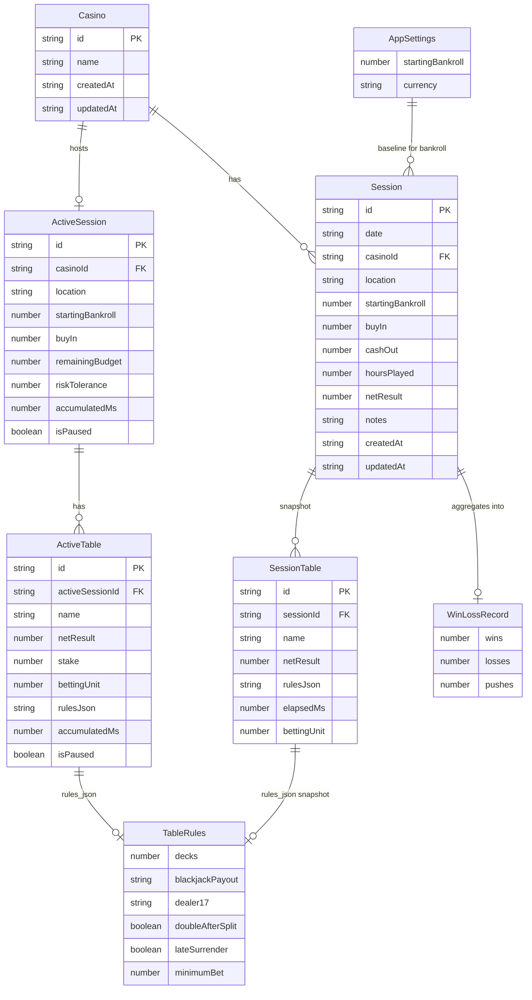
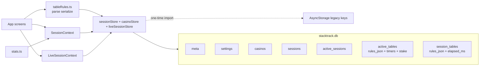

# StackTrack data schema

StackTrack is local-only for the MVP. Persistence uses **expo-sqlite**
(`stacktrack.db`) with validated domain types and no remote backend.

On first launch, sessions start **empty**. Demo data is optional via Settings
→ **Load demo data**.

A one-time migrator imports legacy AsyncStorage envelopes
(`@stacktrack/sessions`, `@stacktrack/settings`) into SQLite, then clears those
keys. `netResult` is normalized to `cashOut - buyIn` during validation.

## SQLite tables

Database file: `stacktrack.db` · schema version: `6` (stored in `meta`)

| Table | Purpose |
| --- | --- |
| `meta` | Key/value flags (`schema_version`, `async_migrated`) |
| `settings` | Singleton row (`id = 1`) for starting bankroll + currency |
| `casinos` | Named venues; sessions are children of a casino |
| `sessions` | One row per completed blackjack sitting |
| `active_sessions` | At most one in-progress live session |
| `active_tables` | Tables for the in-progress live session |
| `session_tables` | Per-table snapshot copied onto completed sessions |

### casinos

| Column | Type | Notes |
| --- | --- | --- |
| `id` | TEXT PK | Client-generated |
| `name` | TEXT | Display name; uniqueness is case-insensitive in app logic |
| `created_at` | TEXT | ISO timestamp |
| `updated_at` | TEXT | ISO timestamp |

Index: `idx_casinos_name` on `(name COLLATE NOCASE)`.

### sessions

| Column | Type | Notes |
| --- | --- | --- |
| `id` | TEXT PK | Client-generated |
| `date` | TEXT | `YYYY-MM-DD` |
| `location` | TEXT | Denormalized casino name (synced from `casinos.name`) |
| `casino_id` | TEXT | FK → `casinos.id` (source of truth) |
| `starting_bankroll` | REAL | Bankroll before session |
| `buy_in` | REAL | Buy-in amount |
| `cash_out` | REAL | Cash-out amount |
| `hours_played` | REAL | From sum of table timers when ended live; manual entry otherwise |
| `net_result` | REAL | `cash_out - buy_in` |
| `notes` | TEXT | Optional |
| `created_at` | TEXT | ISO timestamp |
| `updated_at` | TEXT | ISO timestamp |

Index: `idx_sessions_date` on `(date DESC, created_at DESC)`.

### active_sessions

At most one row. Reloading the app recovers the live session and its tables.

| Column | Type | Notes |
| --- | --- | --- |
| `id` | TEXT PK | Client-generated |
| `casino_id` | TEXT | FK → `casinos.id` (required when live) |
| `location` | TEXT | Denormalized casino name for the live banner |
| `starting_bankroll` | REAL | Bankroll snapshot when the live session started |
| `buy_in` | REAL | Session **budget** chosen at start (`≤ starting_bankroll`) |
| `remaining_budget` | REAL | Chips still available to stake (updated on play/pause) |
| `risk_tolerance` | REAL | Max acceptable BS RoR % (`1|2|5|10|20|25|40`) |
| `segment_started_at` | TEXT | Legacy session timer (unused for hours) |
| `accumulated_ms` | INTEGER | Legacy session timer (unused for hours) |
| `is_paused` | INTEGER | Legacy session timer (unused for hours) |
| `paused_at` | TEXT | Nullable ISO timestamp |
| `created_at` | TEXT | ISO timestamp |
| `updated_at` | TEXT | ISO timestamp |

Money hierarchy: **bankroll** → **session budget** (`buy_in`) → **table stake**.
`remaining_budget = budget + sum(table.net_result) - sum(table.stake)`.

Elapsed time and `hoursPlayed` come from **per-table timers** on
`active_tables` / `session_tables`. Session-level timer columns remain for
schema compatibility only.

Schema v3 migration creates `casinos` from distinct non-empty session /
active `location` strings, sets `casino_id`, and uses `"Unknown casino"` for
empty/orphan rows.

Schema v4 adds table timer columns and `session_tables.elapsed_ms`. If a live
session already had wall-clock time and tables, that elapsed is moved onto the
**first** active table as paused `accumulated_ms` so in-progress sessions are
not zeroed.

Schema v5 adds `remaining_budget` on `active_sessions` and `stake` on
`active_tables`. In-progress rows with null `buy_in` get
`buy_in = starting_bankroll` and `remaining_budget = buy_in`.

Schema v6 adds `risk_tolerance` on `active_sessions` and `betting_unit` on
`active_tables` / `session_tables` (RoR unknown until rules + unit are set).

### active_tables

| Column | Type | Notes |
| --- | --- | --- |
| `id` | TEXT PK | Client-generated |
| `active_session_id` | TEXT FK | → `active_sessions.id` |
| `name` | TEXT | Display name |
| `sort_order` | INTEGER | List order |
| `net_result` | REAL | Cumulative P/L from pause settlements |
| `stake` | REAL | Chips on this table while Playing; `0` when paused |
| `betting_unit` | REAL | Nullable until set on Play; drives RoR |
| `rank_placeholder` | INTEGER | Legacy nullable; ranking is computed from `rules_json` |
| `rules_json` | TEXT | Nullable JSON `TableRules` (see below) |
| `accumulated_ms` | INTEGER | Frozen elapsed while paused / prior segments |
| `segment_started_at` | TEXT | Nullable while paused |
| `is_paused` | INTEGER | `0` / `1` (new tables start paused) |
| `paused_at` | TEXT | Nullable ISO timestamp |
| `created_at` | TEXT | ISO timestamp |
| `updated_at` | TEXT | ISO timestamp |

Only one table may run at a time. Play asks for a **betting unit**
(`≥ minimumBet`) and a stake (`≤ remaining_budget`). Pause asks for ending
chips; `net_result += ending − stake`, stake clears, ending returns to
`remaining_budget`.

**Risk of Ruin (basic strategy heuristic):** unknown until `rules_json` and
`betting_unit` are set. Then
`rorPct = 100 * exp(-units / (10 * max(HE, 0.05)))` with
`units = remaining_budget / betting_unit`. Table is **not viable** when
`rorPct > risk_tolerance`. See `src/lib/riskOfRuin.ts`.

### session_tables

Snapshot of live tables when a session is ended and saved.

| Column | Type | Notes |
| --- | --- | --- |
| `id` | TEXT PK | Client-generated |
| `session_id` | TEXT FK | → `sessions.id` |
| `name` | TEXT | Display name |
| `sort_order` | INTEGER | List order |
| `net_result` | REAL | Table P/L |
| `rank_placeholder` | INTEGER | Legacy nullable; ranking computed from rules |
| `rules_json` | TEXT | Nullable JSON `TableRules` snapshot |
| `elapsed_ms` | INTEGER | Snapshot of table timer at end |
| `betting_unit` | REAL | Nullable snapshot of betting unit |
| `created_at` | TEXT | ISO timestamp |

`rules_json` shape (`src/types/tableRules.ts`):

```ts
{
  decks: 1 | 2 | 4 | 6 | 8 | 10 | 12;
  blackjackPayout: '3:2' | '6:5';
  dealer17: 'S17' | 'H17';
  doubleAfterSplit: boolean;
  lateSurrender: boolean;
  minimumBet: number; // table minimum; default 25
}
```

Defaults when opening the editor with no saved rules: 6 decks, 3:2, S17, DAS yes, late surrender no, `$25` minimum. Legacy `rules_json` without `minimumBet` is filled with `25` on parse. Invalid JSON is treated as unset.

### Ranking (derived)

House edge and favorability are **computed on read** from `rules_json` (not stored):

- Baseline ≈ 0.50% HE for 6D / 3:2 / S17 / DAS / no LS
- Additive deltas for decks, 6:5, H17, no DAS, late surrender (`src/lib/houseEdge.ts`)
- Absolute tiers: favorable (≤ 0.45), average (≤ 0.70), unfavorable (&gt; 0.70)
- Unique lowest HE among tables with rules → “Best rules” highlight only when that table is not `unfavorable`; ties → no exclusive best

### settings

| Column | Type | Notes |
| --- | --- | --- |
| `id` | INTEGER PK | Always `1` |
| `starting_bankroll` | REAL | Default `5000` |
| `currency` | TEXT | Default `USD` |

## Entities

### Casino

Venue entity (`src/types/casino.ts`). Sessions are children of a casino.

| Field | Type | Required | Notes |
| --- | --- | --- | --- |
| `id` | `string` | yes | Generated client-side |
| `name` | `string` | yes | Unique trimmed name (case-insensitive) |
| `createdAt` | `string` | yes | ISO timestamp |
| `updatedAt` | `string` | yes | ISO timestamp |

Managed by `casinoStore` (`loadCasinos`, `addCasino`, `ensureCasino`, `renameCasino`).

### Session

Primary record for one blackjack sitting (TypeScript shape in
`src/types/session.ts`).

| Field | Type | Required | Notes |
| --- | --- | --- | --- |
| `id` | `string` | yes | Generated client-side |
| `date` | `string` | yes | `YYYY-MM-DD` |
| `casinoId` | `string` | yes | FK to casino |
| `location` | `string` | yes | Denormalized casino name for display |
| `startingBankroll` | `number` | yes | Bankroll before this session |
| `buyIn` | `number` | yes | Amount bought in |
| `cashOut` | `number` | yes | Amount cashed out |
| `hoursPlayed` | `number` | yes | Live end: sum of table timers; manual add/edit otherwise |
| `netResult` | `number` | yes | Derived: `cashOut - buyIn` |
| `notes` | `string` | no | Free-form notes |
| `createdAt` | `string` | yes | ISO timestamp |
| `updatedAt` | `string` | yes | ISO timestamp |

`SessionInput` is the create/update payload:

```ts
Omit<Session, 'id' | 'netResult' | 'createdAt' | 'updatedAt'>
```

`id`, `netResult`, `createdAt`, and `updatedAt` are owned by `SessionContext`.

### AppSettings

| Field | Type | Default | Notes |
| --- | --- | --- | --- |
| `startingBankroll` | `number` | `5000` | Baseline before any sessions |
| `currency` | `string` | `"USD"` | Display currency |

### WinLossRecord

Derived stats shape (not persisted).

| Field | Type | Rule |
| --- | --- | --- |
| `wins` | `number` | `netResult > 0` |
| `losses` | `number` | `netResult < 0` |
| `pushes` | `number` | `netResult === 0` |

### ActiveSession / ActiveTable / SessionTable

TypeScript shapes live in `src/types/liveSession.ts`. Managed by
`liveSessionStore` + `LiveSessionContext` (`playTable(id, stake)` /
`pauseTable(id, endingChips)`, `elapsedMs` = sum of table timers).

Completing a live session requires all tables paused with no open stake, then
calls `SessionContext.addSession` with `buyIn = budget`,
`cashOut = remainingBudget`, `hoursPlayed = max(0.01, msToHoursPlayed(sum))`,
copies tables into `session_tables` (including `elapsed_ms`), then clears
`active_*` rows.

| Type | Money / timer fields |
| --- | --- |
| `ActiveSession` | `buyIn` (budget), `remainingBudget`, `riskTolerance`; legacy session timer unused for hours |
| `ActiveTable` | `stake`, `bettingUnit`, `netResult`; timer: `accumulatedMs`, `segmentStartedAt`, `isPaused`, `pausedAt` |
| `SessionTable` | `elapsedMs`, `bettingUnit`, `netResult` (snapshots at end) |

## Derived stats

Computed in `src/lib/stats.ts` from settings + sessions:

| Function | Formula |
| --- | --- |
| `sessionsForCasino(sessions, casinoId)` | filter by `casinoId` |
| `lifetimeProfitLoss(sessions)` | `sum(netResult)` |
| `currentBankroll(starting, sessions)` | `starting + lifetimeProfitLoss` |
| `totalSessions(sessions)` | `sessions.length` |
| `totalHours(sessions)` | `sum(hoursPlayed)` |
| `hourlyRate(sessions)` | `lifetimeProfitLoss / totalHours` (0 if no hours) |
| `winLossRecord(sessions)` | wins / losses / pushes |
| `biggestWin(sessions)` | `max(netResult)` (0 if empty) |
| `biggestLoss(sessions)` | `min(netResult)` (0 if empty) |

Casino screens pass filtered sessions into the same aggregations.

## Entity relationship



`TableRules` is not a separate SQLite table — it is JSON stored in
`active_tables.rules_json` / `session_tables.rules_json`.

`AppSettings` is not a foreign key relationship. Sessions do not store a
settings id; settings is a singleton row used when deriving current bankroll
and formatting money.

## Storage layout



## Future extension points

Keep simulation/training data out of the session tracker schema. Suggested
later additions without rewriting the MVP model:

- Approximate house-edge ranking on `RankBadge` (done) → deeper combinatorial sim later
- `SimulationRun` / `TrainingDrill` tables behind `meta.schema_version` bumps
- Optional cloud sync behind the same `sessionStore` API
